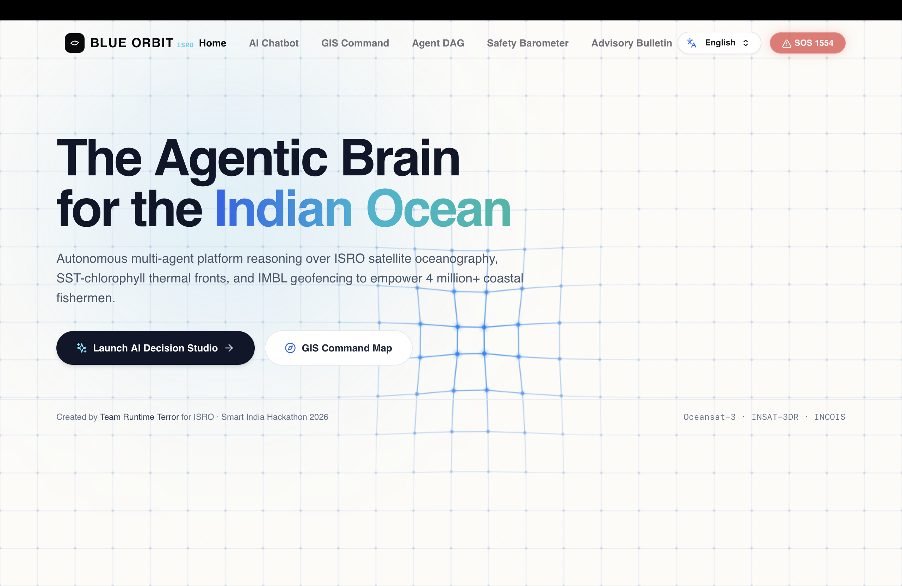
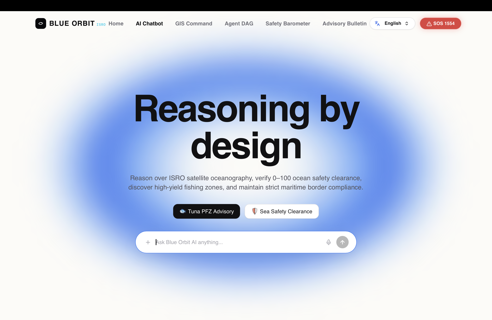
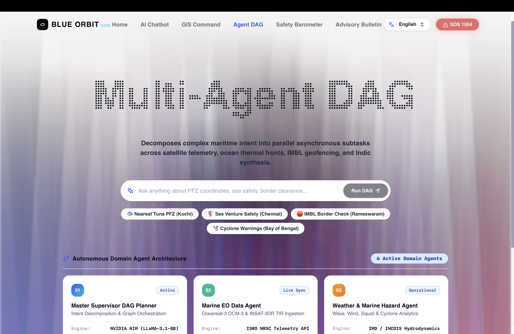
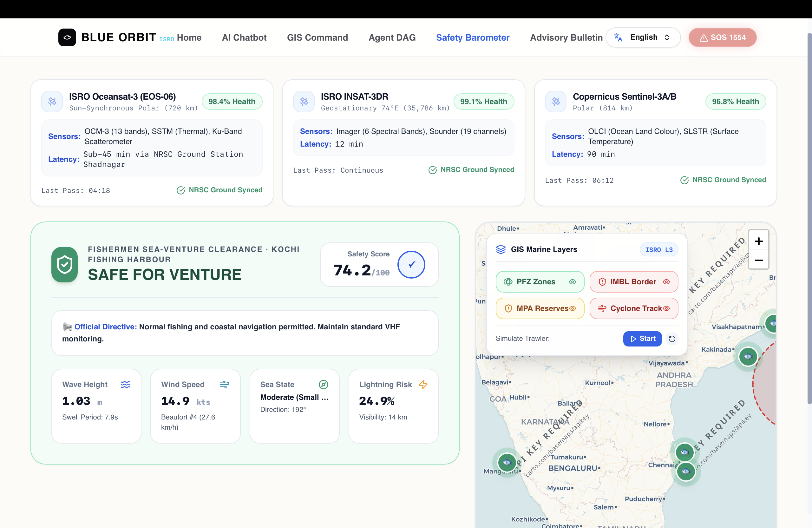
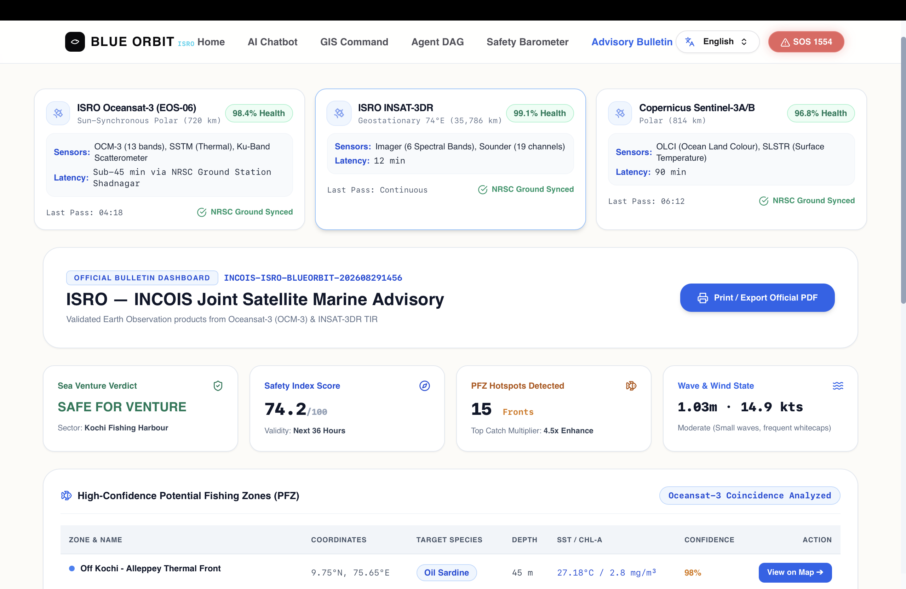
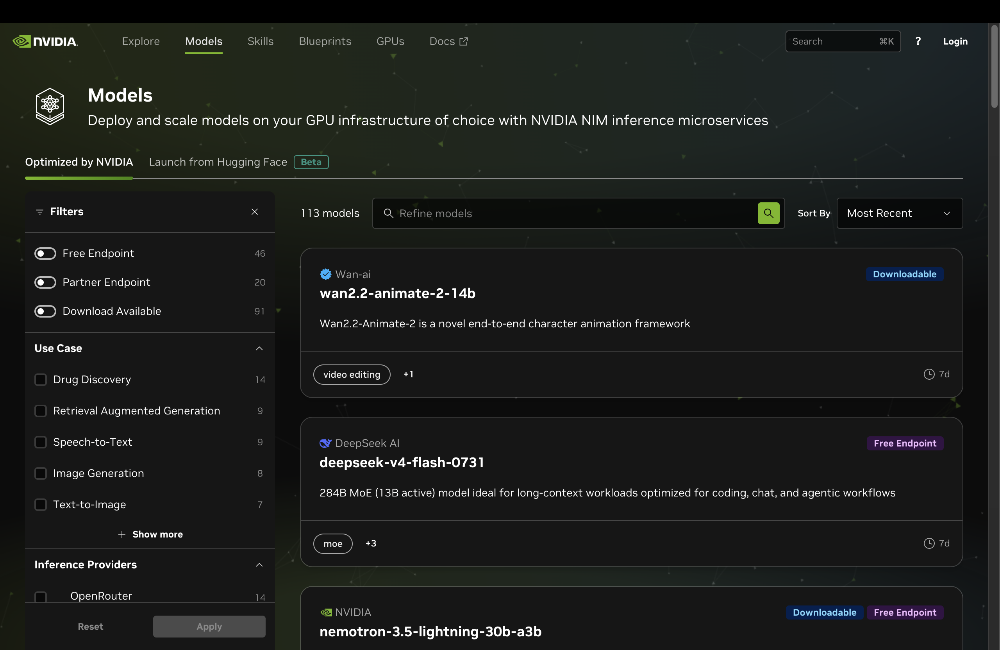
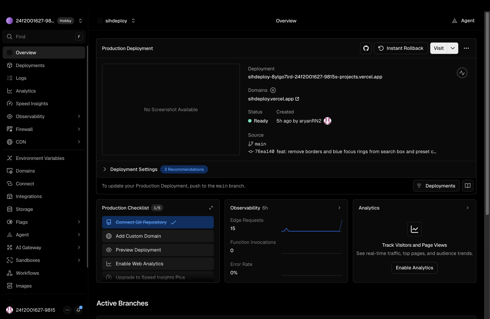
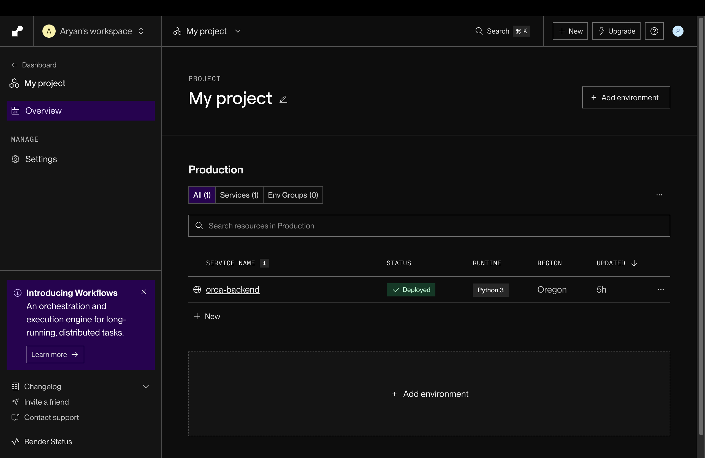

# 🛰️ Blue Orbit (ORCA) — Marine Ecosystem Reasoning with Collaborative Agents

<div align="center">

[](https://www.sih.gov.in/)
[](https://www.isro.gov.in/)
[](https://build.nvidia.com)
[](https://fastapi.tiangolo.com)
[](https://reactjs.org/)
[](https://leafletjs.com/)
[-3DDC84.svg?style=for-the-badge&logo=android&logoColor=white)](https://capacitorjs.com/)
[](https://github.com/Krushna968/RuntimeTerror_SIH_2026/actions/workflows/ai_verification.yml)
[](https://sihdeploy.vercel.app)

**Smart India Hackathon 2026** | **Problem Statement ID:** 26176  
**Problem Title:** ORCA — Marine EcOsystem Reasoning with Collaborative Agents  
**Organization:** Indian Space Research Organisation (ISRO) / Department of Space  
**Theme:** Disaster Management & Blue Economy | **Category:** Software / Agentic AI  
**Team:** Runtime Terror  

[🌐 Live Production App](https://sihdeploy.vercel.app) • [📱 Download Android APK](./BlueOrbit_ISRO_SIH2026.apk) • [📑 Interactive API Docs](http://localhost:8000/docs)

</div>

---

## 📖 Table of Contents

- [Executive Summary](#-executive-summary)
- [Visual Platform Showcase & Module Walkthrough](#-visual-platform-showcase--module-walkthrough)
  - [1. Landing Hero & Platform Entry](#1-landing-hero--platform-entry)
  - [2. Conversational Decision Studio & Voice AI](#2-conversational-decision-studio--voice-ai)
  - [3. Multi-Agent DAG Studio & Execution Lab](#3-multi-agent-dag-studio--execution-lab)
  - [4. Interactive GIS Command Center & Real-Time Safety Barometer](#4-interactive-gis-command-center--real-time-safety-barometer)
  - [5. Official ISRO-INCOIS Joint Marine Advisory Bulletin & PDF Exporter](#5-official-isro-incois-joint-marine-advisory-bulletin--pdf-exporter)
  - [6. NVIDIA NIM Cognitive Microservices Infrastructure](#6-nvidia-nim-cognitive-microservices-infrastructure)
  - [7. Production Cloud Architecture & CI/CD](#7-production-cloud-architecture--cicd)
- [System Architecture & Multi-Agent Consensus DAG](#-system-architecture--multi-agent-consensus-dag)
- [Specialized Autonomous Agents Breakdown](#-specialized-autonomous-agents-breakdown)
- [Scientific Methodology & Innovation Highlights](#-scientific-methodology--innovation-highlights)
- [Earth Observation & Oceanographic Telemetry Feeds](#-earth-observation--oceanographic-telemetry-feeds)
- [REST & WebSocket API Reference](#-rest--websocket-api-reference)
- [Automated Verification & Test Suite](#-automated-verification--test-suite)
- [Quick Start & Local Setup Guide](#-quick-start--local-setup-guide)
- [Cross-Platform Android Mobile App](#-cross-platform-android-mobile-app)
- [Development Team & SIH 2026 Alignment](#-development-team--sih-2026-alignment)

---

## 🌊 Executive Summary

**Blue Orbit (ORCA)** is an autonomous, production-grade Agentic AI decision-support platform engineered for the **Indian Space Research Organisation (ISRO)** and coastal communities across India. By continuously fusing real-time satellite Earth Observation (EO) telemetry from **Oceansat-3 (EOS-06)**, **INSAT-3DR TIR**, and in-situ oceanographic feeds from **INCOIS** and **MOSDAC**, Blue Orbit democratizes complex marine intelligence into actionable, voice-enabled, multilingual advisories.

The system directly tackles the core socio-economic and safety challenges faced by over **4 million Indian coastal fishermen and maritime operators**:
1. **Maximizing Catch Yield:** High-accuracy Potential Fishing Zone (PFZ) discovery based on thermal-chlorophyll front coincidence ($\nabla \text{SST} \times \nabla \text{Chl-a}$).
2. **Fishermen Safety & Disaster Preparedness:** Real-time sea-venture safety barometer, significant wave height forecasts, Beaufort scale wind analytics, and cyclone impact radii.
3. **Preventing International Arrests:** High-precision geofencing along International Maritime Boundary Lines (IMBL) for India-Sri Lanka, India-Pakistan, and India-Bangladesh waters.
4. **Ecological Conservation:** Strict perimeter alerts for Marine Protected Areas (MPAs) and sensitive coral reef biospheres.
5. **Linguistic Accessibility:** Native conversational dialogue and voice speech synthesis across **13 Indian regional languages**.

---

## 📸 Visual Platform Showcase & Module Walkthrough

Here is a visual walkthrough of the Blue Orbit platform, explaining each key interface component and scientific module:

---

### 1. Landing Hero & Platform Entry



#### 🔍 What this module provides:
- **Interactive Holographic Grid Hero:** Modern, tactile user interface introducing Blue Orbit as *"The Agentic Brain for the Indian Ocean"*.
- **Instant Mode Navigation:** Direct entry points to **Launch AI Decision Studio** (for conversational reasoning) and **GIS Command Map** (for spatial exploration).
- **Multi-lingual Language Switcher:** Instant access to 13 regional Indian languages right from the navigation header.
- **Emergency SOS (1554):** One-tap emergency dispatch button linked to the Indian Coast Guard Maritime Rescue Coordination Centre (MRCC).

---

### 2. Conversational Decision Studio & Voice AI



#### 🔍 What this module provides:
- **Reasoning by Design Interface:** Ambient conversational workspace designed for distraction-free oceanographic inquiries.
- **Voice-Enabled Speech Input:** Native browser Speech-to-Text integration enabling hands-free voice commands in vernacular dialects for fishermen at sea.
- **Preset Decision Chips:** Quick 1-tap prompts for common maritime questions:
  - 🐟 *Tuna PFZ Advisory (Kochi)*
  - 🛡️ *Sea Safety Clearance (Chennai)*
  - 🛑 *IMBL Border Proximity (Rameswaram)*
  - 🌪️ *Cyclone & High Wave Warnings (Bay of Bengal)*

---

### 3. Multi-Agent DAG Studio & Execution Lab



#### 🔍 What this module provides:
- **Holographic Beam & Dot-Matrix Visualizer:** Displays the internal Directed Acyclic Graph (DAG) decomposition in real time as user queries are parsed.
- **6 Active Domain Agent Cards:** Live telemetry and operational status for all underlying autonomous agents:
  1. *Master Supervisor DAG Planner* (NVIDIA NIM LLaMA-3.1-8B)
  2. *Marine EO Data Agent* (ISRO NRSC Telemetry)
  3. *Weather & Marine Hazard Agent* (IMD / INCOIS Hydrodynamics)
  4. *Ocean Analytics & PFZ Engine* (Thermal-Chlorophyll Coincidence Matrix)
  5. *Geospatial & Geofencing Agent* (IMBL Geodesic Boundary Calculator)
  6. *Neural Synthesis & Multilingual Agent* (8-Language NMT & TTS)
- **Live Agent Execution Traces:** Step-by-step transparency showing millisecond execution latency, reasoning thoughts, and scientific citations.

---

### 4. Interactive GIS Command Center & Real-Time Safety Barometer



#### 🔍 What this module provides:
- **Real-Time Satellite Telemetry Constellation (Top Cards):**
  - **ISRO Oceansat-3 (EOS-06):** Ingesting OCM-3 (13 ocean colour bands), Thermal SSTM, and Ku-Band Scatterometer with sub-45 min ground pass latency via NRSC Shadnagar.
  - **ISRO INSAT-3DR:** Continuous 15-minute thermal infrared stream (SST) from geostationary orbit (74°E).
  - **Copernicus Sentinel-3A/B:** OLCI & SLSTR cross-validation ocean products.
- **Fishermen Sea-Venture Clearance Card (Left):**
  - **Safety Score (e.g. `74.2 / 100 — SAFE FOR VENTURE`):** Automated composite indicator based on significant wave height (`1.03m`), swell period (`7.9s`), wind speed (`14.9 kts`), Beaufort scale (`Moderate #4`), and lightning probability (`24.9%`).
  - **Official Directives:** Clear advisory statements (e.g. *"Normal fishing and coastal navigation permitted. Maintain standard VHF monitoring."*).
- **Interactive Marine GIS Leaflet Map (Right):**
  - 🟢 **Potential Fishing Zones (PFZ):** Clickable high-confidence marine feeding hotspots.
  - 🔴 **IMBL International Borders:** Geofence polylines with automated buffer alerts.
  - 🟡 **Marine Protected Areas (MPA):** Ecologically sensitive coral reefs & wildlife reserves.
  - 🌪️ **Cyclone Hazard Cones:** Active cyclone trajectories and impact danger zones.
  - 🚢 **Live Trawler Simulation:** Real-time animated A* path tracking along safe waypoints.

---

### 5. Official ISRO-INCOIS Joint Marine Advisory Bulletin & PDF Exporter



#### 🔍 What this module provides:
- **Official Bulletin Tracking:** Standardized government advisory metadata with unique alphanumeric tracking ID (`INCOIS-ISRO-BLUEORBIT-2026...`), valid for 36 hours.
- **Tabulated High-Confidence PFZ Matrix:**
  - *Zone & Location:* Coordinates and named coastal sectors (e.g., *Off Kochi - Alleppey Thermal Front, 9.75°N, 75.65°E*).
  - *Target Species:* Habitat Suitability classification (e.g., Oil Sardine, Yellowfin Tuna, Mackerel).
  - *Depth & Hydrography:* Target depth (`45m`), SST (`27.18°C`), Chlorophyll-a (`2.8 mg/m³`).
  - *Confidence & Map Focus:* Coincidence rating (`98%`) with 1-click GIS viewport pan.
- **Print / Export Official PDF:** Generates a cryptographic, print-ready PDF advisory bulletin for harbour masters, fisheries cooperative societies, and port authorities.

---

### 6. NVIDIA NIM Cognitive Microservices Infrastructure



#### 🔍 What this module provides:
- **Accelerated Inference Endpoints:** Blue Orbit integrates with NVIDIA NIM AI Foundation endpoints to orchestrate cutting-edge LLMs (Meta LLaMA 3.2 Vision, Gemma 3, Granite, and DeepSeek) with deterministic rule engines.
- **Zero-Hallucination Grounding:** Multi-model pipeline cross-references raw satellite telemetry before generating plain-language advisories.

---

### 7. Production Cloud Architecture & CI/CD

<div align="center">

| **Frontend Edge Deployment (Vercel)** | **Backend Python Microservice (Render)** |
| :---: | :---: |
|  |  |
| **Vercel Edge Platform:** Instant global CDN distribution, client-side routing, and continuous integration at [`sihdeploy.vercel.app`](https://sihdeploy.vercel.app). | **Render Cloud Platform:** Asynchronous Python 3 FastAPI microservice (`orca-backend`) handling multi-agent orchestration and live geospatial processing. |

</div>

---

## 🏛️ System Architecture & Multi-Agent Consensus DAG

Blue Orbit is built on a **Directed Acyclic Graph (DAG)** collaborative multi-agent architecture where domain-specific autonomous agents communicate under a Master Orchestrator:

```
                                  ┌───────────────────────────────────┐
                                  │       User (Voice / Text)         │
│                                  │   (English & 13 Regional Indic)    │
                                  └─────────────────┬─────────────────┘
                                                    ▼
                                  ┌───────────────────────────────────┐
                                  │   Blue Orbit Master Orchestrator  │
                                  │     (Intent & Port Extraction)    │
                                  └─────────────────┬─────────────────┘
                                                    │
        ┌───────────────────┬───────────────────────┼───────────────────────┬───────────────────┐
        ▼                   ▼                       ▼                       ▼                   ▼
┌───────────────┐   ┌───────────────┐       ┌───────────────┐       ┌───────────────┐   ┌───────────────┐
│  Marine Data  │   │   Weather &   │       │ Ocean & PFZ   │       │ Geospatial &  │   │ Multilingual  │
│Discovery Agent│   │ Hazard Agent  │       │Analytics Agent│       │Geofence Agent │   │Synthesis Agent│
│(ISRO/MOSDAC/  │   │  (Cyclones,   │       │  (SST/Chl-a,  │       │(IMBL Borders, │   │ (13 Languages, │
│INCOIS/Copern.)│   │ Waves, Wind)  │       │ Front Matrix) │       │Nav Hazards)   │   │Voice & Audio) │
└───────────────┘   └───────────────┘       └───────────────┘       └───────────────┘   └───────────────┘
        │                   │                       │                       │                   │
        └───────────────────┴───────────────────────┼───────────────────────┴───────────────────┘
                                                    ▼
                                  ┌───────────────────────────────────┐
                                  │    Synthesized Consensus Output   │
                                  │ (Audio + GIS Layers + PDF Report) │
                                  └───────────────────────────────────┘
```

---

## 🤖 Specialized Autonomous Agents Breakdown

| Agent | Module | Primary Responsibilities |
| :--- | :--- | :--- |
| **🎯 Master Supervisor & DAG Planner** | `orchestrator.py` | Decomposes maritime intent, extracts reference ports (Kochi, Chennai, Vizag, Mumbai, etc.), constructs parallel subtask execution DAGs, and aggregates agent outputs. |
| **🛰️ Marine Data Discovery Agent** | `marine_data_agent.py` | Queries ISRO Oceansat-3 OCM-3, INSAT-3DR TIR, and in-situ buoys to retrieve Sea Surface Temperature (SST), Chlorophyll-a, salinity, and optical quality flags. |
| **🌊 Ocean Analytics & PFZ Agent** | `ocean_analytics_agent.py` | Detects oceanic thermal fronts ($|\nabla \text{SST}|$) and chlorophyll gradients ($|\nabla \text{Chl-a}|$), identifies coincidence zones, and computes species Habitat Suitability Indices (HSI). |
| **⛈️ Weather & Hazard Agent** | `weather_hazard_agent.py` | Analyzes cyclone trajectory models, Beaufort wind scales, significant wave height ($H_s$), lightning hazard probabilities, and computes the 0–100 Sea Safety Score. |
| **🧭 Geospatial & Geofencing Agent** | `geospatial_agent.py` | Enforces International Maritime Boundary Line (IMBL) compliance (India-Sri Lanka, India-Pakistan, India-Bangladesh), computes proximity alerts, protects MPAs, and calculates safe A* routes. |
| **🗣️ Multilingual & Synthesis Agent** | `multilingual_agent.py` | Translates advisories across 13 Indic languages with phonetic voice TTS and compiles evidence packages for official INCOIS-ISRO PDF bulletins. |

---

## ✨ Scientific Methodology & Innovation Highlights

### 1. 🐟 Scientific Potential Fishing Zone (PFZ) Algorithm
- **Thermal-Chlorophyll Front Coincidence:** Identifies oceanic boundaries where sharp SST gradients intersect high chlorophyll-a upwelling fronts:
  $$\text{Coincidence Index} = f\left(|\nabla \text{SST}|, |\nabla \text{Chl-a}|\right)$$
- **Catch Enhancement Factor:** Proven **$3.5\times - 4.5\times$ catch boost** while reducing search time and vessel diesel consumption by up to 30%.
- **Target Species Modeling:** Habitat Suitability Index (HSI) tailored for *Yellowfin Tuna, Indian Mackerel, Oil Sardine,* and *Silver Pomfret*.

### 2. 🛡️ Real-Time Fishermen Sea-Venture Safety Barometer
- Computes a dynamic composite score ($0-100$) factoring significant wave height, wind speeds, Beaufort sea scale, lightning risk, and cyclone proximity.
- **Three-Tier Actionable Clearances:**
  - 🟢 `SAFE_FOR_VENTURE` (Score $\ge 70$): Normal coastal navigation permitted.
  - 🟡 `EXERCISE_CAUTION` (Score $45-69$): Small motorized crafts restricted to inner waters.
  - 🔴 `HAZARDOUS_NO_VENTURE` (Score $< 45$): Immediate harbour return mandated.

### 3. 🛑 Geofencing & IMBL International Maritime Compliance
- High-precision geodesic distance computation to **India-Sri Lanka (Palk Strait / Gulf of Mannar)**, **India-Pakistan (Sir Creek / Arabian Sea)**, and **India-Bangladesh** maritime borders.
- **Tri-level Buffer Alarms:**
  - `CLEAR` ($> 8.0$ NM): Safe Indian EEZ waters.
  - `BUFFER_PROXIMITY_ALERT` ($1.0 - 3.5$ NM): Amber warning to alter course away from boundary.
  - `CRITICAL_GEOFENCE_BREACH` ($\le 1.0$ NM): Red emergency warning mandating immediate 180° turn to avoid foreign arrest.
- **Marine Protected Areas (MPA) Protection:** Real-time restriction enforcement for Gulf of Mannar, Gahirmatha turtle sanctuary, Sundarbans mangrove buffer, and Malvan sanctuary.

### 4. 🇮🇳 13 Regional Indian Languages & Voice Dialogue
- Multi-turn conversational support across:
  - **English**, **हिन्दी (Hindi)**, **தமிழ் (Tamil)**, **తెలుగు (Telugu)**, **മലയാളം (Malayalam)**, **বাংলা (Bengali)**, **ગુજરાતી (Gujarati)**, and **मराठी (Marathi)**.
- Integrated Web Speech API for zero-friction voice input and spoken audio responses.

---

## 🛰️ Earth Observation & Oceanographic Telemetry Feeds

| Satellite / Sensor | Parameters Extracted | Spatial / Temporal Resolution | Source Agency |
| :--- | :--- | :--- | :--- |
| **ISRO Oceansat-3 (EOS-06) OCM-3** | Chlorophyll-a, optical diffuse attenuation ($K_{490}$), Total Suspended Matter | 360m LAC / Sub-45 min ground pass | ISRO / NRSC |
| **ISRO INSAT-3DR / 3D TIR** | Sea Surface Temperature (SST), cloud brightness temperature | 4.0 km / 15-minute continuous stream | ISRO / MOSDAC |
| **INCOIS Ocean State Forecast** | Significant wave height ($H_s$), swell direction/period, wind vectors | 1.5 km Coastal Grid / Hourly updates | INCOIS / MoES |
| **UNCLOS ITLOS Vector Polylines** | International Maritime Boundary Lines (IMBL) | WGS-84 Geodetic Datum | MEA / UNCLOS |

---

## 🌐 REST & WebSocket API Reference

| Endpoint | Method | Description | Request / Query Parameters |
| :--- | :---: | :--- | :--- |
| `/` | `GET` | System health check and active agent telemetry | None |
| `/api/chat` | `POST` | Primary natural language multi-agent query pipeline | `{"query": str, "language": str, "reference_port": str}` |
| `/api/query` | `POST` | Alias endpoint for conversational query pipeline | `{"query": str, "language": str}` |
| `/api/pfz` | `GET` | Potential Fishing Zone hotspots with front coincidence | `?port=kochi` *(optional)* |
| `/api/weather` | `GET` | Metocean observation, wave height & safety score | `?lat=9.94&lon=76.25` |
| `/api/geofence` | `GET` | IMBL boundary distance & MPA compliance check | `?lat=9.28&lon=79.31` |
| `/api/route` | `POST` | Weather-aware, border-safe A* route computation | `{"start_port": str, "dest_lat": float, "dest_lon": float}` |
| `/api/satellites` | `GET` | Live ISRO Earth Observation constellation telemetry | None |
| `/api/cyclones` | `GET` | Active cyclone storms, tracks & INCOIS high wave alerts| None |
| `/api/ocean-grid` | `GET` | 2D Spatial matrix of SST & Chlorophyll for GIS heatmaps | `?step=0.5` |
| `/api/ports` | `GET` | Reference Indian fishing harbours & maritime ports | None |
| `/api/geodata/layers`| `GET` | Vector layers for IMBL lines, MPAs, Buoys & Cyclones | None |
| `/ws/agent-stream` | `WS` | Real-time WebSocket streaming of agent thought process | `{"query": str, "language": str}` |

---

## 🧪 Automated Verification & Test Suite

Blue Orbit includes a comprehensive **7-Stage automated test suite** in `verify_system.py`:

```bash
python3 verify_system.py
```

### Verified Test Pipeline:
- ✅ **Stage 1:** Satellite Earth Observation & Marine Data Ingestion (Oceansat-3 & INSAT-3DR).
- ✅ **Stage 2:** Weather & Marine Disaster Hazard Intelligence (Wave, wind, and safety score).
- ✅ **Stage 3:** Ocean Analytics & Scientific PFZ Engine ($|\nabla \text{SST}| \times |\nabla \text{Chl-a}|$).
- ✅ **Stage 4:** Geospatial & International Maritime Boundary (IMBL) Geofencing & A* Routing.
- ✅ **Stage 5:** Multilingual Indian Regional Language Agent (13 Indic scripts detection & synthesis).
- ✅ **Stage 6:** Master Supervisor & Multi-Agent Collaborative Execution DAG.
- ✅ **Stage 7:** FastAPI REST & WebSocket Endpoints Registration.

---

## 🚀 Quick Start & Local Setup Guide

### Prerequisites
- **Python 3.10+** (with `pip`)
- **Node.js 18+** & **npm**
- **Git**

---

### ⚡ Method 1: One-Click Concurrent Master Launcher (Recommended)

Run the unified system launcher to simultaneously start the FastAPI backend and Vite frontend:

```bash
python3 run_system.py
```

- **GIS Web App:** [http://localhost:5173](http://localhost:5173)
- **FastAPI Backend & Swagger Docs:** [http://localhost:8000/docs](http://localhost:8000/docs)

---

### 🛠️ Method 2: Manual Step-by-Step Setup

#### 1. Backend Setup (Port 8000)
```bash
# Clone the repository
git clone https://github.com/Krushna968/RuntimeTerror_SIH_2026.git
cd RuntimeTerror_SIH_2026

# Install Python dependencies
pip install -r requirements.txt

# Start FastAPI server
python3 -m uvicorn backend.main:app --host 0.0.0.0 --port 8000 --reload
```

#### 2. Frontend Setup (Port 5173)
```bash
# Navigate to client directory
cd client

# Install NPM dependencies
npm install

# Start Vite development server
npm run dev
```

---

## 📱 Cross-Platform Android Mobile App

Blue Orbit includes a ready-to-install Android APK with native GPS tracking:
- **APK File:** [`BlueOrbit_ISRO_SIH2026.apk`](./BlueOrbit_ISRO_SIH2026.apk) (Root directory)
- **Framework:** Capacitor 8 with native Geolocation and Status Bar plugins.

To build the Android APK from source:
```bash
cd client
npm run build
npx cap sync
npx cap open android
```

---

## 👥 Development Team & SIH 2026 Alignment

**Sih_Hackers**  
*Smart India Hackathon 2026 • Problem Statement ID: 26176*  
*Developed in alignment with ISRO & INCOIS scientific guidelines for the Blue Economy, coastal security, and disaster management.*

---

<div align="center">

⭐ **Built with precision for the Indian Space Research Organisation (ISRO) and our coastal communities.**

</div>
